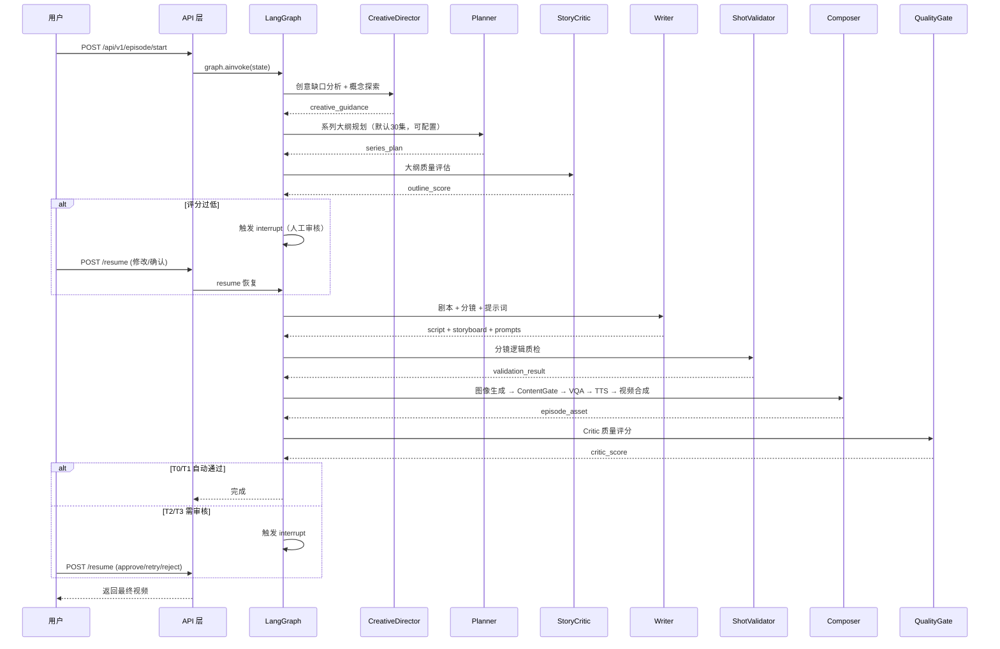

# 🎬 AI Manga Agent - 垂直漫剧超级工厂

> 基于 LangGraph 的 6-Agent 协作管线，将创意简报自动转换为可发布的漫剧视频

[]()
[]()
[]()
[]()

---

## ✨ 功能特性

- **创意到视频全链路自动化**：从模糊创意 → 剧本创作 → 分镜设计 → 图像生成 → 视频合成 → 质量审核
- **6-Agent 协作管线**：Creative Director → Planner → Story Critic → Writer → Shot Validator → Composer
- **双质量门禁**：ContentGate（生成前风格一致性检查）+ QualityGate（生成后人工审核路由）
- **VQA 视觉质检**：KEY_SCENE 物理异常检测（多指、畸形、水印等）
- **断点续传**：基于 Checkpoint 的故障恢复机制，崩溃后从失败点继续
- **成本可观测**：完整的 LLM/图像/视频成本追踪与预算控制
- **Seed Audio 1.0 整合**：TTS + 背景音 + BGM 一站式音频生成
- **角色一致性三重保障**：固定 seed + 身份证特征 + 三视图锚点（front/side/back），跨集角色形象零漂移
- **跨集角色锚点持久化**：首集生成三视图 + canonical appearance 写入 DB，后续集自动加载复用
- **音画对齐硬约束**：TTS 6 项质量校验 + 视频生成严格使用 TTS 真实时长，杜绝音画不同步
- **剧集数可配置**：用户输入指定集数，不输入默认 30 集（上限 200 集保护）
- **视频内容质检**：Seedance 图生视频后阻断式质检（抽帧 + CLIP 相似度 + VLM 人物完整性），拦截肢体断裂/面部扭曲/外观漂移
- **视频全链路加固**：下载校验 + ffprobe 文件验证 + 三层重试（L0/L1/L2）+ 最终视频健康检查 + 原子化 checkpoint

## 🏗️ 技术架构

```
┌─────────────────────────────────────────────────────────────────┐
│                     API 层 (FastAPI)                           │
│   REST / WebSocket / Swagger UI  ——  接收请求、推送进度         │
└─────────────────────────────┬─────────────────────────────────┘
                              │
┌─────────────────────────────▼─────────────────────────────────┐
│                    LangGraph 编排层                           │
│   16 节点 DAG + interrupt + checkpointer + 并行执行          │
└─────────────────────────────┬─────────────────────────────────┘
                              │
┌─────────────────────────────▼─────────────────────────────────┐
│                      6-Agent 管线                            │
│  creative_director → planner → story_critic                  │
│  writer → shot_validator → composer                          │
└─────────────────────────────┬─────────────────────────────────┘
                              │
┌─────────────────────────────▼─────────────────────────────────┐
│                质量控制层 + 媒体生成                           │
│  ContentGate / VQA / Seed Audio / Flux / Seedance            │
└─────────────────────────────┬─────────────────────────────────┘
                              │
┌─────────────────────────────▼─────────────────────────────────┐
│              持久化层 (PostgreSQL / Redis / MinIO)            │
│  成本账本 / 数据血缘 / Checkpoint / 媒体资产                   │
└─────────────────────────────────────────────────────────────┘
```

## 🚀 快速开始

### 环境要求

- **Python** 3.11+
- **PostgreSQL** 15+（成本追踪、数据血缘）
- **Redis** 7+（缓存、长期记忆）
- **MinIO**（可选，媒体资产存储）
- **CUDA 12.1**（NudeNet NSFW 检测）
- **LLM API Key**（DeepSeek 或 DashScope）

### 安装

```bash
# 1. 克隆仓库
git clone https://github.com/zyu221281-commits/ai_manga_agent.git
cd ai_manga_agent

# 2. 创建 Conda 环境
conda env create -f environment.yml
conda activate ai_manga_agent

# 或使用虚拟环境
python -m venv .venv
.venv\Scripts\activate  # Windows
source .venv/bin/activate  # Linux/macOS
pip install -r requirements.txt  # 如需 requirements.txt
```

### 配置

```bash
# 复制环境变量模板
cp .env.example .env

# 编辑 .env，至少填写以下项：
#   DEEPSEEK_API_KEY   - DeepSeek LLM（必需）
#   或 DASHSCOPE_API_KEY - 通义千问（必需）
#   ARK_API_KEY        - 火山方舟图像/视频（可选）
#   POSTGRES_PASSWORD  - PostgreSQL 密码（推荐）
```

### 启动服务

```bash
# 使用 Docker Compose 启动基础设施
docker-compose up -d

# 初始化数据库
make migrate

# 启动 API 服务（默认监听 0.0.0.0:8000）
make run

# 或直接启动
uvicorn app.main:app --host 0.0.0.0 --port 8000 --reload
```

### 快速测试

```bash
# 单集完整管线测试
python scripts/run_one_episode.py
```

## 📡 API 文档

启动服务后访问 [http://localhost:8000/docs](http://localhost:8000/docs) 查看 Swagger UI。

### 主要端点

| 方法   | 路径                          | 说明                     |
| ------ | ----------------------------- | ------------------------ |
| `GET`  | `/health`                     | 健康检查                 |
| `POST` | `/api/v1/series/`             | 创建系列                 |
| `POST` | `/api/v1/episode/`            | 创建单集                 |
| `POST` | `/api/v1/episode/{id}/start`  | 启动生产管线             |
| `POST` | `/api/v1/episode/{id}/resume` | 恢复中断的任务           |
| `GET`  | `/api/v1/cost/`               | 预算看板                 |
| `GET`  | `/api/v1/review/`             | 审核队列                 |
| `WS`   | `/ws`                         | 实时进度 WebSocket       |

### 请求示例

```bash
# 创建并启动单集
curl -X POST http://localhost:8000/api/v1/episode/start \
  -H "Content-Type: application/json" \
  -d '{
    "creative_brief": {
      "theme": "修仙逆袭",
      "genre": "玄幻热血",
      "tone": "热血激昂",
      "summary": "少年林风天生废脉，意外获得龙魂传承，从此逆天改命",
      "characters": [
        {"name": "林风", "role": "男主", "traits": ["坚韧", "重情义"]},
        {"name": "苏月", "role": "女主", "traits": ["冷傲", "聪慧"]}
      ]
    }
  }'
```

## 📁 项目结构

```
ai_manga_agent/
├── app/                          # 主应用
│   ├── agents/                   # 6 个核心 Agent
│   │   ├── creative_director.py  # 创意探索与方向选择
│   │   ├── planner.py            # 系列大纲规划
│   │   ├── story_critic.py       # 大纲吸引力评估
│   │   ├── writer.py             # 剧本 + 分镜 + 提示词
│   │   ├── shot_validator.py     # 分镜逻辑质检
│   │   ├── composer.py           # 图像→视频→音频合成
│   │   └── pipeline/             # Composer 管线编排
│   │       ├── context.py        # 管线上下文
│   │       └── orchestrator.py   # 编排器
│   ├── api/                      # FastAPI 路由
│   ├── core/                     # 配置与工具
│   ├── services/                 # 业务服务
│   ├── state/                    # LangGraph 状态与图定义
│   ├── quality/                  # 质量控制模块
│   │   ├── visual_descriptor.py  # 视觉描述规范化
│   │   └── character_consistency.py # 角色锚点 + 三视图
│   ├── resilience/               # 韧性与适配器
│   └── tasks/                    # Celery 任务
├── scripts/                      # 运行脚本
├── .env.example                  # 环境变量模板
├── Dockerfile                    # 容器镜像
├── docker-compose.yml            # 基础设施编排
├── environment.yml               # Conda 环境
├── Makefile                      # 命令封装
└── README.md                     # 项目说明
```

## 🔧 核心流程



## 🎯 Agent 职责说明

| Agent | 职责 | 输出 |
|-------|------|------|
| **CreativeDirector** | 探索 3-5 种创意方向，评估病毒传播潜力，选择最优方案 | creative_guidance |
| **Planner** | 生成系列大纲（默认 30 集，可配置），设计角色成长弧线，规划悬念钩子 | series_plan |
| **StoryCritic** | 双模型投票评估大纲吸引力（冲突密度/反转频率/角色弧线） | outline_score |
| **Writer** | 剧本创作 + 分镜设计 + 图像提示词 + 伏笔管理 | script + storyboard + prompts |
| **ShotValidator** | 检查空间连续性、角色一致性、镜头节奏、提示词完整性 | validation_result |
| **Composer** | 图像生成 + ContentGate + VQA + TTS + 视频合成 + 封面选择 | episode_asset |

## 🎨 质量门禁

### ContentGate（生成前）

- **CLIP 风格相似度**：相邻镜头风格一致性检查
- **角色一致性**：身份证特征比对 + 三视图锚点（front/side/back），确保同一角色形象统一

### 角色一致性深度保障

跨集角色形象零漂移的三重机制：

1. **三视图锚点**：首集为每个角色生成 front/side/back 三个视角的参考图，持久化到 DB
2. **Canonical Appearance**：从角色身份证 100% 原文复制外貌描述，首集写入后不覆盖（防 drift）
3. **跨集复用**：每集启动时自动从 DB 加载锚点，按 `camera_angle` 选最佳视角 ref_image
4. **视频约束**：canonical appearance 注入视频生成 prompt，文本+视觉双重约束

### TTS 质量校验 + 音画对齐

视频生成严格使用 TTS 真实时长，杜绝音画不同步：

- **6 项 TTS 校验**：result 非空 / local_path 非空 / 文件存在 / 文件 ≥1KB / duration ≥0.5s / 时长文本比例 ∈ [0.33, 3.0]
- **恢复机制**：校验失败时优先从 checkpoint 恢复，否则重新生成（最多 2 次）
- **硬约束**：无 TTS 时长的 shot 直接跳过视频生成（不使用 storyboard 估算 fallback）

### VQA Checker（图像生成后）

| 检测项 | 说明 |
|--------|------|
| polydactyly | 多指检测 |
| limb_deformity | 肢体畸形 |
| impossible_physics | 物理异常 |
| watermark | 水印检测 |
| facial_distortion | 面部扭曲 |

### VideoContentChecker（视频生成后阻断式）

Seedance 图生视频后立即质检，不通过则删除文件并触发下一层重试，防止问题视频进入最终合成。

- **抽帧**：ffmpeg 在视频 30% / 50% / 70% 位置抽取 3 帧
- **CLIP 相似度**：每帧与源图计算余弦相似度，阈值默认 0.72（`VIDEO_CONTENT_CHECK_CLIP_THRESHOLD`）
- **VLM 人物完整性**：仅 KEY_SCENE，qwen-vl-max 检查肢体完整性 / 面部扭曲 / 外观漂移 / 运动伪影
- **阻断式设计**：任一不通过 → `passed=False` → 删文件 → 进入下一层重试（L0→L1→L2→跳过）
- **降级策略**：模型/API 不可用时返回 `passed=True`，不阻断生产

### 视频全链路加固

| 环节 | 校验内容 |
|------|----------|
| 下载后 | 内容 < 10KB 拒绝 + ffprobe 验证可播放且时长 > 0.5s |
| 重试层 | 文件存在 / 大小 > 10KB / 扩展名 .mp4 / ffprobe 可解码 |
| 合成阶段 | concat/combine 失败升级为 error 日志，时长 < 预期 70% 升级为 error |
| 最终视频 | ffprobe 验证视频流存在 + 格式可解析 + 时长 > 0.5s |
| Checkpoint | `tempfile.mkstemp` + `os.replace()` 原子写入，写入中断不损坏已有数据 |
| Seedance 轮询 | 自适应间隔（5s→5s→10s→10s→15s）+ 可配置超时 `VIDEO_POLL_MAX_WAIT_S` |

### Critic 分级路由

| Tier | 条件 | 处理方式 |
|------|------|----------|
| T0 | 评分 ≥0.85，非首集 | 自动发布 |
| T1 | 评分 ≥0.7，非首集 | 自动发布 |
| T2 | 评分 ≥0.5 或首集 | 4h 自动通过 / 人工审核 |
| T3 | 评分 <0.5 或重试耗尽 | 强制人工审核 |

## 💰 成本控制

### 预算配置

```bash
# .env 配置项
COST_BUDGET_PER_EPISODE_USD=1.5    # 单集预算
COST_DAILY_CAP_USD=15.0            # 每日上限
COST_MONTHLY_CAP_USD=300.0         # 每月上限
COST_ALERT_THRESHOLD=0.8           # 告警阈值
COST_HARD_STOP_THRESHOLD=1.0       # 硬止损阈值
```

### 成本构成

| 服务 | 单价 | 说明 |
|------|------|------|
| DeepSeek-V4-Pro | $0.27/1M 输入 + $1.10/1M 输出 | 主 LLM |
| Flux | ~$0.003/张 | 普通图像 |
| Seedream | ~$0.02/张 | 角色身份证 |
| Seedance | $0.30/秒 | 图生视频 |
| Seed Audio | $0.02/秒 | TTS + 背景音 |

## 📊 可观测性

### 追踪与审计

- **FileLineageTracker**：文件级数据血缘，记录每个 Agent 的输入输出
- **CostTracker**：完整成本账本，支持日/月/单集预算查询
- **CheckpointManager**：断点恢复，避免重复 LLM 调用

### Prometheus 指标

```
# Agent 耗时分布
agent_duration_seconds{agent="writer"}

# 成本统计
cost_total_usd{model="deepseek-v4-pro"}

# 质量门禁通过率
quality_gate_pass_rate{tier="T0"}
```

## 🌟 项目亮点

- **LangGraph 最佳实践**：16 节点 DAG + interrupt + checkpointer 完整实现
- **角色一致性三重保障**：固定 seed + 身份证特征 + 三视图锚点，跨集角色形象零漂移
- **Seed Audio 整合**：TTS + 背景音 + BGM 一站式，音频质量大幅提升
- **双质量门禁**：生成前预防 + 生成后拦截，确保内容质量
- **断点续传**：崩溃后从失败点继续，节省大量重新生成成本
- **成本可观测**：实时追踪、预算告警、硬止损三重保障
- **音画对齐硬约束**：TTS 6 项质量校验 + 视频严格使用 TTS 真实时长
- **视频内容质检**：Seedance 图生视频后立即质检（抽帧 + CLIP + VLM），拦截肢体断裂/面部扭曲/外观漂移
- **视频全链路加固**：下载校验 + ffprobe 验证 + 三层重试 + 最终健康检查 + 原子化 checkpoint

## 📝 更新日志

### v3.0.0 — 视频生成链路生产环境修复

针对视频生成 → 质检 → 合成全链路在生产环境暴露的 7 类问题进行修复，新增 1 个文件，修改 6 个文件。

#### 1. 视频下载后无文件校验

`video_adapter.py` 的 `_download()` 下载视频后直接使用，不验证文件有效性。API 返回错误页面（200 OK 但内容是 HTML）或下载不完整的文件会直接进入后续流程。

- 下载后检查内容大小，< 10KB 直接拒绝
- 新增 `_validate_video_file()` 静态方法，用 ffprobe 验证文件可播放且时长 > 0.5s
- 校验失败返回空字符串，触发调用方的重试逻辑

#### 2. Composer 视频结果校验不足

`composer.py` 的 `_generate_videos()` 在每个重试层成功后只判断 `local_path` 是否为真值，不验证文件是否真实存在、大小是否合理。

- 新增 `_validate_video_result()` 静态方法：文件存在 / 大小 > 10KB / 扩展名 .mp4 / ffprobe 可解码
- 在 L0/L1/L2 每个重试成功后调用，不通过则删除文件并继续下一层重试

#### 3. 合成阶段静默降级

`episode_compositor.py` 中拼接失败时静默降级为第一个 shot 的视频（整场内容丢失），combine 失败时静默降级为无音频视频，时长异常只打 warning。

- concat/combine 失败日志从 warning 升为 error，记录丢失的 shot 范围与具体文件路径
- 输出时长短于预期的 70% 时升级为 error，记录损失百分比

#### 4. Checkpoint 非原子写入

`checkpoint_manager.py` 的 `_write()` 直接覆盖写 JSON 文件，并发场景下可能因写入中断导致 checkpoint 损坏。

- 改为 `tempfile.mkstemp` + `os.replace()` 原子重命名模式
- 先写临时文件，成功后原子替换目标文件，写入中断不会损坏已有数据

#### 5. 最终视频无健康检查

`compose_episode()` 在最终视频生成后只检查文件是否存在，不验证视频是否可播放。

- 新增 `_validate_final_video()`：ffprobe 验证视频流存在 / 格式可解析 / 时长 > 0.5s
- 健康检查不通过返回 `success=False` + 具体错误信息

#### 6. Seedance 轮询优化

`video_adapter.py` 中 Seedance 任务轮询固定 15s 间隔、10 分钟超时硬编码、无任务取消机制。

- 自适应轮询间隔：5s → 5s → 10s → 10s → 15s（先快后慢）
- 超时改为可配置 `VIDEO_POLL_MAX_WAIT_S`（默认 600s）
- 单次 poll 异常不退出循环，继续重试

#### 7. 视频内容质量缺失（核心）

图像生成后有 ContentGate（CLIP 风格检查）和 VQA（物理异常检查），但视频生成后完全无内容质检。Seedance 图生视频可能产生人物肢体断裂/缺失、面部扭曲、外观漂移、运动伪影等问题，有问题的视频直接进入最终合成。

- 新增 [`app/quality/video_content_checker.py`](app/quality/video_content_checker.py) — `VideoContentChecker` 视频内容质检器
- 抽帧：ffmpeg 在视频 30% / 50% / 70% 位置抽取 3 帧
- CLIP 相似度：每帧与源图计算余弦相似度，阈值默认 0.72
- VLM 人物完整性：仅 KEY_SCENE，qwen-vl-max 检查肢体完整性 / 面部扭曲 / 外观漂移 / 伪影
- 任一不通过 → 删除视频文件 → 继续下一层重试
- 模型/API 不可用时降级为通过，不阻断生产
- `composer.py` 在 L0/L1/L2 每个重试层中，文件校验通过后执行内容质检
- 新增配置项：`VIDEO_CONTENT_CHECK_ENABLED` / `VIDEO_CONTENT_CHECK_CLIP_THRESHOLD` / `VIDEO_CONTENT_CHECK_VLM_ENABLED`

#### 视频生成新流程

```
L0: Seedance 生成
  → 文件校验（存在/大小/ffprobe）     ← #1 #2
  → 内容质检（抽帧+CLIP+VLM）         ← #7
  → ✔ 通过 → 保存 checkpoint         ← #4（原子写入）
  → ✘ 不通过 → 删文件, 进入 L1

L1: 换 motion 重试
  → 文件校验                          ← #2
  → 内容质检                          ← #7
  → ✔ 通过 → 保存 checkpoint
  → ✘ 不通过 → 删文件, 进入 L2

L2: Seedance 重试
  → 文件校验                          ← #2
  → 内容质检                          ← #7
  → ✔ 通过 → 保存 checkpoint
  → ✘ 不通过 → 跳过该 shot

最终合成
  → 降级日志（error 级别）            ← #3
  → 健康检查（视频流+可播放性）        ← #5
```

#### 涉及文件

| 文件 | 操作 |
|------|------|
| `app/resilience/adapters/video_adapter.py` | 修改 #1 #6 |
| `app/agents/composer.py` | 修改 #2 #7 |
| `app/services/episode_compositor.py` | 修改 #3 #5 |
| `app/services/checkpoint_manager.py` | 修改 #4 |
| `app/core/config.py` | 修改 #6 #7 |
| `app/quality/video_content_checker.py` | 新建 #7 |
| `.env.example` | 更新 |

---

### v2.0.0 — 角色一致性 + 音画对齐深度优化

本次更新围绕"跨集角色一致性"和"音画对齐"两大核心问题进行深度优化，新增 6 个文件，修改 17 个文件。

#### 1. 剧集数可配置化

将硬编码的 60 集改为用户可配置，不输入时默认 30 集（上限 200 集保护）。

- 集数获取链路：`creative_brief["episode_count"]` → `settings.DEFAULT_TOTAL_EPISODES` (30) → 上限保护
- 涉及文件：`config.py`、`planner.py`、`creative_director.py`、`asset_manager.py`、`series_batch_task.py`、`task_splitter.py`

#### 2. 角色一致性深度优化（文描规范化）

新增 `VisualDescriptor` + `PromptTemplateEngine`，从 storyboard + id_card 自动提取视觉规范。

- 角色 appearance 100% 从 `id_card` 原文复制（零变体）
- 仅 pose/expression/position 每集自由
- `camera_angle` 必填，按视角选最佳 ref_image
- 纯规则引擎，零 LLM 成本
- 新增文件：[`app/quality/visual_descriptor.py`](app/quality/visual_descriptor.py)

#### 3. 三视图前置约束（跨集一致性）

`CharacterAnchorModel` 增加 front/side/back 三视图字段，首集生成后持久化到 DB，后续集自动加载复用。

- 首集：生成三视图 + canonical appearance 写入 DB（seed_prompt 不覆盖防 drift）
- 第 2~N 集：启动时 `load_all_anchors()` 加载 → `has_multi_view` 命中跳过 → 视频 prompt 注入同一外貌
- 图像生成用三视图作 ref_image（视觉约束）
- 视频生成用 canonical appearance 注入 prompt_text（文本约束）
- 涉及文件：`character_consistency.py`、`asset_manager.py`、`episode_task.py`、`graph_builder.py`、`composer.py`、`init.sql`

#### 4. TTS 质量校验 + 音画对齐硬约束

修复 `composer_video_gen_node` 未传 `shot_durations` 的既有 bug，并加强 TTS 质量校验。

- **TTS 6 项校验**：result 非空 / local_path 非空 / 文件存在 / 文件 ≥1KB / duration ≥0.5s / 时长文本比例 ∈ [0.33, 3.0]
- **恢复机制**：校验失败时优先从 checkpoint 恢复（同 shot_id 旧 TTS），否则重新生成（最多 2 次）
- **硬约束**：`shot_durations=None` 时所有 shot 跳过视频生成；无 TTS 时长的 shot 跳过（不再使用 storyboard 估算 fallback）
- 仅校验通过的 TTS 才写入 checkpoint（避免污染）
- 涉及文件：`composer.py`（`_validate_tts_result` + `_recover_tts_segment`）、`graph_builder.py`

#### 兼容性

- 所有改动向后兼容（旧 anchor 自动回退到 seed_image）
- scene-level 合成策略完全兼容（空 VideoResult 自动过滤）
- 旧 checkpoint 数据可继续使用（新字段可选）

#### 测试

v2.0.0 阶段曾包含三视图跨集一致性、TTS 校验 + 音画对齐等功能验证脚本，已在 v3.0.0 中精简。仓库现仅保留 `scripts/run_one_episode.py` 作为单集管线入口。

---

## 📄 License

MIT License
