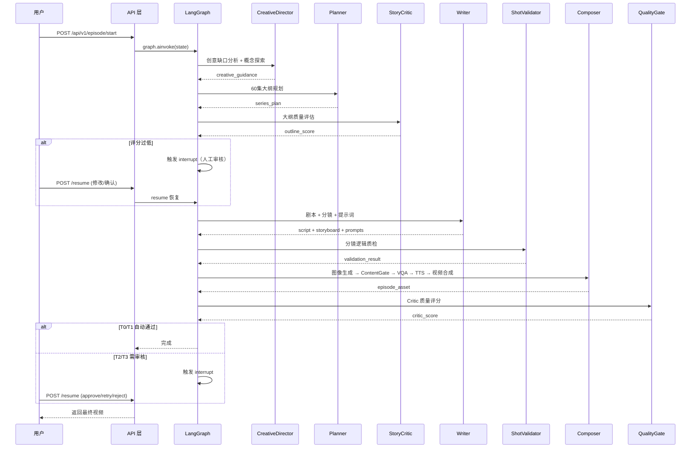

# 🎬 AI Manga Agent - 垂直漫剧超级工厂

> 基于 LangGraph 的 6-Agent 协作管线，将创意简报自动转换为可发布的漫剧视频

[]()
[]()
[]()
[]()

---

## ✨ 功能特性

- **创意到视频全链路自动化**：从模糊创意 → 剧本创作 → 分镜设计 → 图像生成 → 视频合成 → 质量审核
- **6-Agent 协作管线**：Creative Director → Planner → Story Critic → Writer → Shot Validator → Composer
- **双质量门禁**：ContentGate（生成前风格一致性检查）+ QualityGate（生成后人工审核路由）
- **VQA 视觉质检**：KEY_SCENE 物理异常检测（多指、畸形、水印等）
- **断点续传**：基于 Checkpoint 的故障恢复机制，崩溃后从失败点继续
- **成本可观测**：完整的 LLM/图像/视频成本追踪与预算控制
- **Seed Audio 1.0 整合**：TTS + 背景音 + BGM 一站式音频生成
- **角色一致性保障**：固定 seed + 身份证特征，确保多集角色形象统一

## 🏗️ 技术架构

```
┌─────────────────────────────────────────────────────────────────┐
│                     API 层 (FastAPI)                           │
│   REST / WebSocket / Swagger UI  ——  接收请求、推送进度         │
└─────────────────────────────┬─────────────────────────────────┘
                              │
┌─────────────────────────────▼─────────────────────────────────┐
│                    LangGraph 编排层                           │
│   16 节点 DAG + interrupt + checkpointer + 并行执行          │
└─────────────────────────────┬─────────────────────────────────┘
                              │
┌─────────────────────────────▼─────────────────────────────────┐
│                      6-Agent 管线                            │
│  creative_director → planner → story_critic                  │
│  writer → shot_validator → composer                          │
└─────────────────────────────┬─────────────────────────────────┘
                              │
┌─────────────────────────────▼─────────────────────────────────┐
│                质量控制层 + 媒体生成                           │
│  ContentGate / VQA / Seed Audio / Flux / Seedance            │
└─────────────────────────────┬─────────────────────────────────┘
                              │
┌─────────────────────────────▼─────────────────────────────────┐
│              持久化层 (PostgreSQL / Redis / MinIO)            │
│  成本账本 / 数据血缘 / Checkpoint / 媒体资产                   │
└─────────────────────────────────────────────────────────────┘
```

## 🚀 快速开始

### 环境要求

- **Python** 3.11+
- **PostgreSQL** 15+（成本追踪、数据血缘）
- **Redis** 7+（缓存、长期记忆）
- **MinIO**（可选，媒体资产存储）
- **CUDA 12.1**（NudeNet NSFW 检测）
- **LLM API Key**（DeepSeek 或 DashScope）

### 安装

```bash
# 1. 克隆仓库
git clone https://github.com/zyu221281-commits/ai_manga_agent.git
cd ai_manga_agent

# 2. 创建 Conda 环境
conda env create -f environment.yml
conda activate ai_manga_agent

# 或使用虚拟环境
python -m venv .venv
.venv\Scripts\activate  # Windows
source .venv/bin/activate  # Linux/macOS
pip install -r requirements.txt  # 如需 requirements.txt
```

### 配置

```bash
# 复制环境变量模板
cp .env.example .env

# 编辑 .env，至少填写以下项：
#   DEEPSEEK_API_KEY   - DeepSeek LLM（必需）
#   或 DASHSCOPE_API_KEY - 通义千问（必需）
#   ARK_API_KEY        - 火山方舟图像/视频（可选）
#   POSTGRES_PASSWORD  - PostgreSQL 密码（推荐）
```

### 启动服务

```bash
# 使用 Docker Compose 启动基础设施
docker-compose up -d

# 初始化数据库
make migrate

# 启动 API 服务（默认监听 0.0.0.0:8000）
make run

# 或直接启动
uvicorn app.main:app --host 0.0.0.0 --port 8000 --reload
```

### 快速测试

```bash
# 单集完整管线测试
python scripts/run_one_episode.py

# 完整系列生成
python scripts/run_full_pipeline.py --series "s_xianxia_001" --episodes 5
```

## 📡 API 文档

启动服务后访问 [http://localhost:8000/docs](http://localhost:8000/docs) 查看 Swagger UI。

### 主要端点

| 方法   | 路径                          | 说明                     |
| ------ | ----------------------------- | ------------------------ |
| `GET`  | `/health`                     | 健康检查                 |
| `POST` | `/api/v1/series/`             | 创建系列                 |
| `POST` | `/api/v1/episode/`            | 创建单集                 |
| `POST` | `/api/v1/episode/{id}/start`  | 启动生产管线             |
| `POST` | `/api/v1/episode/{id}/resume` | 恢复中断的任务           |
| `GET`  | `/api/v1/cost/`               | 预算看板                 |
| `GET`  | `/api/v1/review/`             | 审核队列                 |
| `WS`   | `/ws`                         | 实时进度 WebSocket       |

### 请求示例

```bash
# 创建并启动单集
curl -X POST http://localhost:8000/api/v1/episode/start \
  -H "Content-Type: application/json" \
  -d '{
    "creative_brief": {
      "theme": "修仙逆袭",
      "genre": "玄幻热血",
      "tone": "热血激昂",
      "summary": "少年林风天生废脉，意外获得龙魂传承，从此逆天改命",
      "characters": [
        {"name": "林风", "role": "男主", "traits": ["坚韧", "重情义"]},
        {"name": "苏月", "role": "女主", "traits": ["冷傲", "聪慧"]}
      ]
    }
  }'
```

## 📁 项目结构

```
ai_manga_agent/
├── app/                          # 主应用
│   ├── agents/                   # 6 个核心 Agent
│   │   ├── creative_director.py  # 创意探索与方向选择
│   │   ├── planner.py            # 系列大纲规划
│   │   ├── story_critic.py       # 大纲吸引力评估
│   │   ├── writer.py             # 剧本 + 分镜 + 提示词
│   │   ├── shot_validator.py     # 分镜逻辑质检
│   │   └── composer.py           # 图像→视频→音频合成
│   ├── api/                      # FastAPI 路由
│   ├── core/                     # 配置与工具
│   ├── services/                 # 业务服务
│   ├── state/                    # LangGraph 状态与图定义
│   ├── quality/                  # 质量控制模块
│   ├── resilience/               # 韧性与适配器
│   └── tasks/                    # Celery 任务
├── scripts/                      # 运行脚本
├── .env.example                  # 环境变量模板
├── Dockerfile                    # 容器镜像
├── docker-compose.yml            # 基础设施编排
├── environment.yml               # Conda 环境
├── Makefile                      # 命令封装
└── README.md                     # 项目说明
```

## 🔧 核心流程



## 🎯 Agent 职责说明

| Agent | 职责 | 输出 |
|-------|------|------|
| **CreativeDirector** | 探索 3-5 种创意方向，评估病毒传播潜力，选择最优方案 | creative_guidance |
| **Planner** | 生成 60 集系列大纲，设计角色成长弧线，规划悬念钩子 | series_plan |
| **StoryCritic** | 双模型投票评估大纲吸引力（冲突密度/反转频率/角色弧线） | outline_score |
| **Writer** | 剧本创作 + 分镜设计 + 图像提示词 + 伏笔管理 | script + storyboard + prompts |
| **ShotValidator** | 检查空间连续性、角色一致性、镜头节奏、提示词完整性 | validation_result |
| **Composer** | 图像生成 + ContentGate + VQA + TTS + 视频合成 + 封面选择 | episode_asset |

## 🎨 质量门禁

### ContentGate（生成前）

- **CLIP 风格相似度**：相邻镜头风格一致性检查
- **角色一致性**：身份证特征比对，确保同一角色形象统一

### VQA Checker（生成后）

| 检测项 | 说明 |
|--------|------|
| polydactyly | 多指检测 |
| limb_deformity | 肢体畸形 |
| impossible_physics | 物理异常 |
| watermark | 水印检测 |
| facial_distortion | 面部扭曲 |

### Critic 分级路由

| Tier | 条件 | 处理方式 |
|------|------|----------|
| T0 | 评分 ≥0.85，非首集 | 自动发布 |
| T1 | 评分 ≥0.7，非首集 | 自动发布 |
| T2 | 评分 ≥0.5 或首集 | 4h 自动通过 / 人工审核 |
| T3 | 评分 <0.5 或重试耗尽 | 强制人工审核 |

## 💰 成本控制

### 预算配置

```bash
# .env 配置项
COST_BUDGET_PER_EPISODE_USD=1.5    # 单集预算
COST_DAILY_CAP_USD=15.0            # 每日上限
COST_MONTHLY_CAP_USD=300.0         # 每月上限
COST_ALERT_THRESHOLD=0.8           # 告警阈值
COST_HARD_STOP_THRESHOLD=1.0       # 硬止损阈值
```

### 成本构成

| 服务 | 单价 | 说明 |
|------|------|------|
| DeepSeek-V4-Pro | $0.27/1M 输入 + $1.10/1M 输出 | 主 LLM |
| Flux | ~$0.003/张 | 普通图像 |
| Seedream | ~$0.02/张 | 角色身份证 |
| Seedance | $0.30/秒 | 图生视频 |
| Seed Audio | $0.02/秒 | TTS + 背景音 |

## 📊 可观测性

### 追踪与审计

- **FileLineageTracker**：文件级数据血缘，记录每个 Agent 的输入输出
- **CostTracker**：完整成本账本，支持日/月/单集预算查询
- **CheckpointManager**：断点恢复，避免重复 LLM 调用

### Prometheus 指标

```
# Agent 耗时分布
agent_duration_seconds{agent="writer"}

# 成本统计
cost_total_usd{model="deepseek-v4-pro"}

# 质量门禁通过率
quality_gate_pass_rate{tier="T0"}
```

## 🌟 项目亮点

- **LangGraph 最佳实践**：16 节点 DAG + interrupt + checkpointer 完整实现
- **角色一致性保障**：固定 seed + 身份证特征，多集角色形象不漂移
- **Seed Audio 整合**：TTS + 背景音 + BGM 一站式，音频质量大幅提升
- **双质量门禁**：生成前预防 + 生成后拦截，确保内容质量
- **断点续传**：崩溃后从失败点继续，节省大量重新生成成本
- **成本可观测**：实时追踪、预算告警、硬止损三重保障

## 📄 License

MIT License
